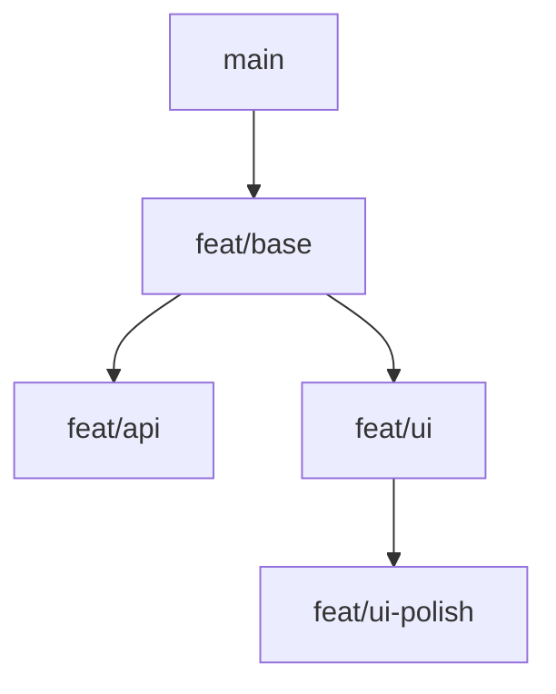
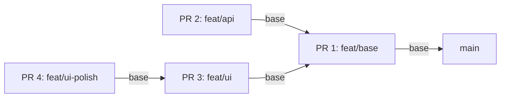
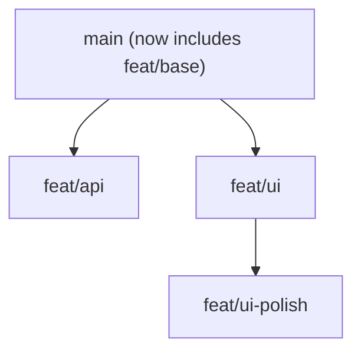
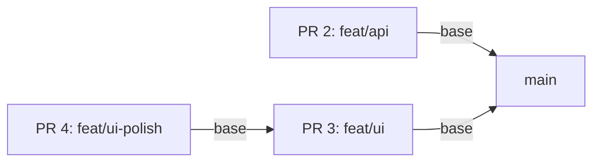

# jjacks Tutorial

This tutorial is for the current shape of `jjacks`: a repo-local CLI that helps turn a `jj` bookmark stack into a GitHub PR stack.

## Mental Model

- `main` is trunk.
- You usually sit on an empty working copy on top of `main` or on top of the tip of a stack.
- `jjacks create <bookmark>` turns the current working copy into the next named layer in the stack.
- `jjacks sync` looks at the current active stack, refreshes it against trunk, and reconciles GitHub to match it.

## Example Stack Shape

Here is one useful stacked-review shape:

- the first PR branches from `main`
- that PR has two children
- one of those children has its own child

### Bookmark Topology



You can read that as:

- `feat/base` is the first review layer off trunk
- `feat/api` and `feat/ui` both depend on `feat/base`
- `feat/ui-polish` depends on `feat/ui`

### PR Base Relationships

When synced to GitHub, the intended PR bases look like this:



That means:

- `feat/base` targets `main`
- `feat/api` targets `feat/base`
- `feat/ui` targets `feat/base`
- `feat/ui-polish` targets `feat/ui`

### Why This Shape Helps

This kind of stack is useful when one shared foundation needs to land first, but the follow-up work can still be reviewed in parallel:

- reviewers can look at `feat/api` separately from `feat/ui`
- `feat/ui-polish` stays small and only includes the delta from `feat/ui`
- if `feat/base` changes, the rest of the stack can be retargeted and refreshed from that shared layer

### After The Base PR Merges

Once `feat/base` lands in `main`, the surviving children should be restacked so they no longer point at the merged layer.



And the intended PR bases become:



That is the core idea behind `jjacks sync`:

- merged lower layers disappear from the active stack
- surviving child work is rebased onto fresh trunk
- PR bases are updated to match the new stack shape

## Before You Start

You need:

- Node.js 22 or newer
- `git`
- `jj`
- GitHub CLI `gh`
- `gh auth login` completed for the target GitHub host
- a Git repo that is also a `jj` repo
- a configured GitHub remote
- `gh` auth that can create and edit pull requests
- `advance-bookmarks.enabled = true`

Install from a local checkout until the first package release:

```bash
npm install
npm run build
npm link
```

After a package release:

```bash
npm install --global jjacks
```

## Config

`jjacks` reads its settings from JJ config instead of a separate `.jjacks.config.js` file.

That means you can use JJ's normal config scopes:

- user
- repo
- workspace

To see the exact config file path JJ is using for a given scope:

```bash
jj config path --user
jj config path --repo
jj config path --workspace
```

Typical JJ config locations:

- user config on macOS: `$HOME/Library/Application Support/jj/config.toml`
- repo config: `.jj/repo/config.toml`
- workspace config: use `jj config path --workspace` for the current workspace

`jjacks` follows JJ's normal config resolution, so the effective value is the same one you would get from `jj config get`.

### Supported `jjacks` Keys

#### `jjacks.stack_comments.location`

Controls where `jjacks` writes the stack breadcrumb block for synced pull requests.

Supported values:

- `comment`
- `description`

Behavior:

- `comment` writes the stack block as a dedicated PR comment
- `description` writes the stack block into the PR description body and keeps it updated there

Default:

```toml
[jjacks.stack_comments]
location = "comment"
```

Set it with JJ:

```bash
jj config set --user jjacks.stack_comments.location description
```

Or at repo scope:

```bash
jj config set --repo jjacks.stack_comments.location description
```

## Shell Completions

`jjacks` can print shell completion scripts:

```bash
source <(jjacks --completions zsh)
source <(jjacks --completions bash)
jjacks --completions fish | source
```

## Common Flow

### 1. Start from clean trunk

The happy-path starting point is:

- `main` matches `origin/main`
- your working copy is an empty scratch change on top of `main`
- `jjacks status` says there is no active bookmark stack yet

That empty working copy is normal. `jjacks` should treat it as the place where the next bookmark begins.

### 2. Create the first bookmark

Create a named layer from the current working copy:

```bash
jjacks create feat/my-change
```

After that:

- the current working copy should carry the `feat/my-change` bookmark
- your code changes should still be on that same change
- `jjacks status` should show one active stack entry

### 3. Add more stacked layers

Once the current change is where you want it, open the next layer and name it:

```bash
jjacks create feat/my-follow-up
```

The intent is one bookmark per reviewable PR layer.

### Getting A Remote Branch

If someone else pushed a branch and you want to bring it into your local `jj` workspace, run:

```bash
jjacks get feat/coworker-branch
```

`get` supports one branch at a time. It prints a plan and asks before it fetches, creates or moves the local bookmark, and edits the working copy to that bookmark.

For a non-mutating preview:

```bash
jjacks get feat/coworker-branch --dry-run
```

If a local bookmark with the same name exists and points somewhere else, `get` can overwrite it after confirmation. That overwrite prompt defaults to `No`.

### 4. Review the sync plan

Run:

```bash
jjacks sync
```

Before applying changes, `jjacks` should show the plan and ask for confirmation.

The preview should tell you:

- which local refresh actions will run
- which bookmarks will be rebased onto fresh trunk
- which stack entries are blocked by local conflicts

For each syncable active stack entry, it should also show:

- whether the bookmark needs to be pushed
- whether a PR will be created
- whether an existing PR title or base will be updated
- what stack comment changes are planned

For automation or scripts, use:

```bash
jjacks sync --dry-run
```

That prints the plan without changing local state or GitHub.

### 5. Apply the plan

When the preview looks right, answer `Y` to apply it.

For a non-interactive apply:

```bash
jjacks sync --execute
```

`--execute` may fetch, move the local default bookmark, push stack bookmarks, create or edit pull requests, and update stack breadcrumbs.

If it fails midway:

- run `jjacks status`
- inspect the local stack and PR mapping
- fix the underlying issue, such as GitHub auth, branch protection, conflicts, or a missing remote
- rerun `jjacks sync`

`jjacks` does not currently attempt rollback for GitHub side effects. Most steps are rediscovered on the next run, so rerunning sync after fixing the root cause is the intended recovery path.

## Moving Around the Stack

Use:

- `jjacks up`
- `jjacks down`

These move between bookmarks in the current bookmark lane.

They should follow the current bookmark lane rather than jumping around unrelated descendants elsewhere in the repo.

If a bookmark has multiple child bookmarks above it, `jjacks up` should prompt you to choose which child bookmark to continue from.

## Syncing After Lower PRs Merge

When lower layers merge and trunk moves:

```bash
jjacks sync
```

The intended behavior is:

- fetch fresh trunk
- restack any still-open work onto it
- leave you on a continuation working copy ready to keep going
- push and retarget any PRs whose local stack entries are clean
- block any conflicted stack entry and all of its descendants from GitHub mutation

If no stack remains, `sync` should refresh trunk and report that there is no active bookmark stack.

If a stack entry conflicts during restack, that entry and its descendants should not be pushed, retargeted, created, or updated on GitHub. Clean sibling subtrees may still sync.

## Status Expectations

`jjacks status` is meant to answer one question: what does the current active stack look like right now?

It should not treat unrelated bookmarks elsewhere in the repo as part of your current stack.

Examples:

- empty scratch working copy on `main` -> no active bookmark stack
- one bookmarked change on `main` -> one active stack entry
- multiple bookmarked descendants in the current lane -> ordered active stack entries

## Current Non-Goals

Right now `jjacks` is still intentionally narrow:

- no PR body authoring
- no generalized multi-stack repo management UI
- no attempt to model every possible `jj` topology

The goal at this stage is a reliable happy path for a bookmark-based GitHub stacking workflow.
